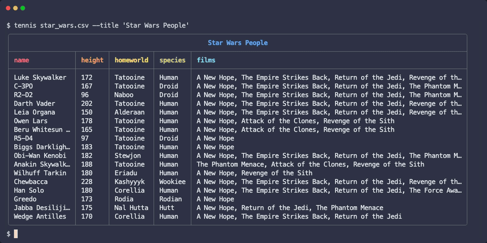

# Tennis [](https://github.com/gurgeous/tennis/actions/workflows/test.yml)

`tennis` is a tool for printing stylish CSV tables in your terminal. Rows will be truncated to fit
and it'll automatically pick nice colors to fit your terminal.



### Installation

```sh
# install from source
$ go install github.com/gurgeous/tennis/cmd@latest

# coming soon - brew
$ ....
```

### Important Features

- auto-themes to pick light or dark based on your terminal background
- auto-layout to fit your terminal window
- titles, row numbers, placeholders...


### Options

```
Usage: tennis [<file.csv>] [flags]

CSV pretty printer.

Flags:
      --color="auto"    Turn color off and on with auto|never|always
      --theme="auto"    Select color theme auto|dark|light
  -n, --row-numbers     Turn on row numbers
  -t, --title=STRING    Add a pretty title at the top
  -w, --width=INT       Set table width in columns (0 = auto)
```

### Coming Soon: Library

Tennis is built with golang and can be used in your projects as a package. Plug it in to create your own beautiful tables. You can use the package to print an array of golang structs, for example. The tennis library should be considered beta quality and may change before release.

### Similar Tools

We love CSV tools and use them all the time! Here are a few that we rely on:

- [bat](https://github.com/sharkdp/bat) - syntax highlights csv files, and many others
- [csvlens](https://github.com/YS-L/csvlens) & [tidy viewer](https://github.com/alexhallam/tv) - great viewers for CSV files, beautiful and fun
- [qsv](https://github.com/dathere/qsv) - filter, sort, combine, join... (a fork of [xsv](https://github.com/BurntSushi/xsv)). I contributed a nice `color` command for printing tables.
- [table_tennis](https://github.com/gurgeous/table_tennis) - the ruby version of `tennis`
- [visidata](https://www.visidata.org) - the best for poking around large files, it does everything
