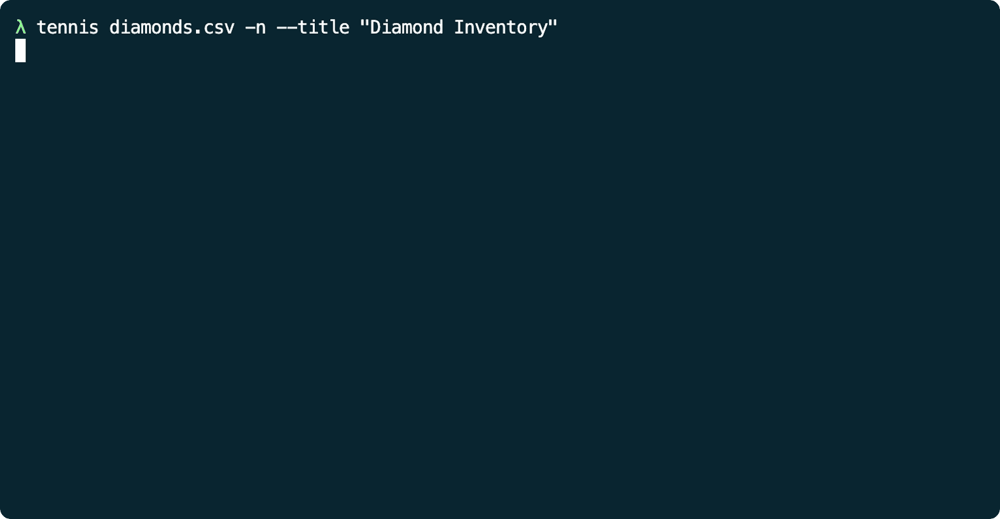

[](https://github.com/gurgeous/tennis/actions/workflows/ci.yml)


# Tennis

`tennis` is a small CLI for printing stylish CSV tables in your terminal. Rows will be truncated to fit and it'll automatically pick nice colors to match your terminal. Written in Zig. Demo:



### Installation

#### Brew/macos

```sh
$ brew install gurgeous/tap/tennis
```

#### Linux tarball

Download a binary from https://github.com/gurgeous/tennis/releases. Copy into your path somewhere. I like to use ~/.local/bin personally. Also see the (optional) bash/zsh completions and man page in `extra/`.

#### Build from source

```sh
# this will build zig-out/bin/tennis
$ mise trust && mise install
$ zig build
```

### Important Features

- auto-layout to fit your terminal window
- auto-themes to pick light or dark based on your terminal background
- titles, row numbers...

### Options

```
 Usage: tennis [options...] <file.csv>     # print file.csv
        tennis [options...]                # print csv from stdin

  -d, --delimiter <char>   CSV delim (can be any char or "tab")
  -n, --row-numbers        Turn on row numbers
  -t, --title <string>     Add a title to the table
  -w, --width <int>        Set max table width in chars

      --border <border>    Table border style (rounded|thin|double|...)
      --color <color>      Turn color off and on (on|off|auto)
      --completion <shell> Print a shell completion script (bash|zsh)
      --digits <int>       Digits after decimal for float columns (1-6)
      --theme <theme>      Select color theme (auto|dark|light)
      --vanilla            Disable numeric formatting entirely
      --help               Get help
      --version            Show version number and exit
```

Note that color defaults to `on`. Tennis likes to be colorful.

### An Aside: Term Background

`tennis` uses a `termbg.zig` module to detect the terminal background color so it can choose the correct theme (dark or light). Detection is complicated, and I'm calling it out here because I don't think anyone has implemented this in Zig yet.

### Future Work

There are many features I can add if there is demand, including zebra striping, numeric formatting, color scales, more control over column layout, etc. Other areas to explore:

- windows support
- use `zg` for string measuring and truncation of graphemes (vs codepoints)

### Similar Tools

We love CSV tools and use them all the time! Here are a few that we rely on:

- [bat](https://github.com/sharkdp/bat) - syntax highlights csv files, and many others
- [csvlens](https://github.com/YS-L/csvlens), [tabiew](https://github.com/shshemi/tabiew) & [tidy viewer](https://github.com/alexhallam/tv) - great viewers for CSV files, beautiful and fun
- [miller](https://github.com/johnkerl/miller) - csv processing and transformation
- [nushell](https://www.nushell.sh) - modern shell with first-class structured table data
- [qsv](https://github.com/dathere/qsv) - filter, sort, combine, join... (a fork of [xsv](https://github.com/BurntSushi/xsv))
- [Terminal::Table](https://github.com/tj/terminal-table) - wonderful rubygem for pretty printing tables, great for non-hash data like confusion matrices
- [visidata](https://www.visidata.org) - the best for poking around large files, it does everything
- [table_tennis](https://github.com/gurgeous/table_tennis) - my own project, the basis for this one

### Changelog

#### 0.0.4 (unreleased)

- Configurable `--border` styles based on Nushell / `tabled` crate. (@gurgeous)

#### 0.0.3 (Mar '26)

- Custom `--delimiter` for tsv, semicolon, etc. #5 (@markhm)
- Auto numeric formatting, including delims and rounding for int/float columns. Disable with --vanilla. #6 (@gurgeous)
- man page & shell completions #7 #10 (@gurgeous)

#### 0.0.2 (Mar '26)

- Initial release.

### Special Thanks

- [termbg](https://github.com/dalance/termbg) and [termenv](https://github.com/muesli/termenv) for showing how to safely detect the terminal background color. These libraries are widely used for Rust/Go, but as far as I know nothing similar exists for Zig.
- I copied the header color themes from [tabiew](https://github.com/shshemi/tabiew). Great project!
- Border styles pinched from [nushell](https://www.nushell.sh) and [tabled](https://github.com/zhiburt/tabled) crate. Thanks guys!
