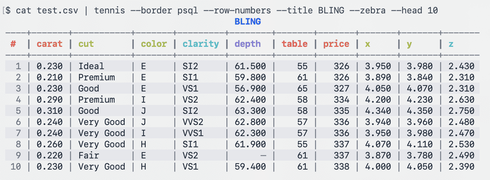
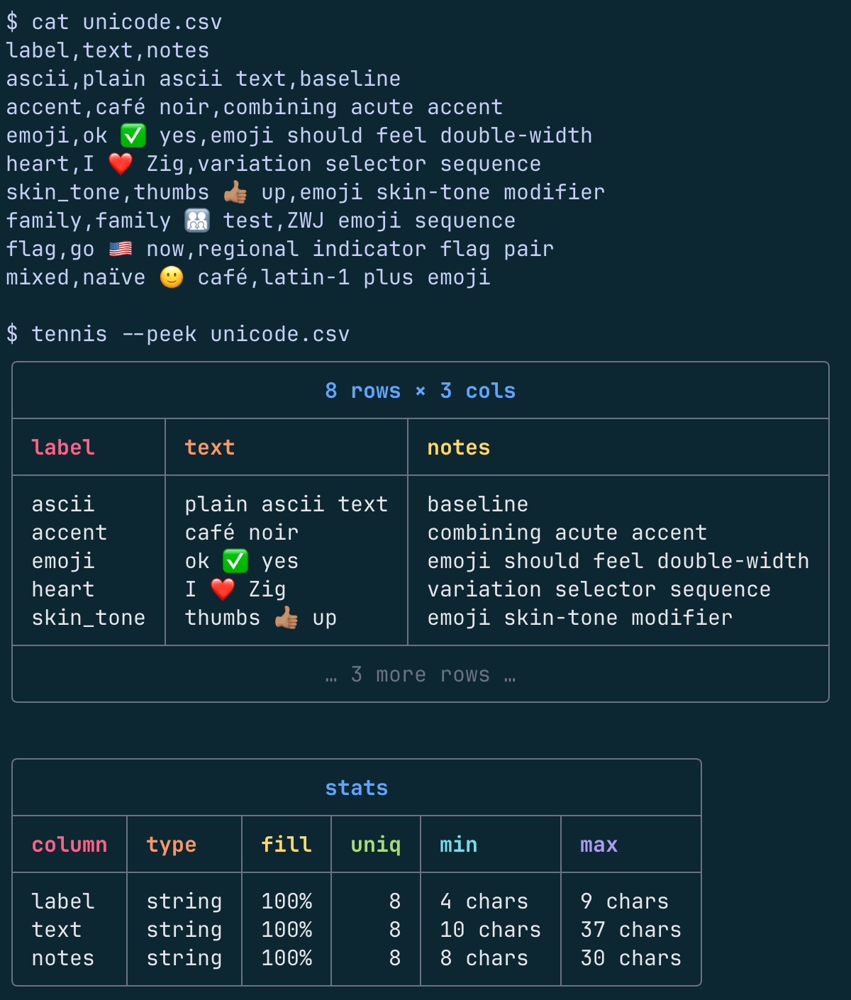

[](https://github.com/gurgeous/tennis/actions/workflows/ci.yml)


# Tennis

`tennis` is a small CLI for printing stylish CSV tables in your terminal. Rows will be truncated to fit, and it will automatically pick nice colors to match your terminal. Written in Zig. Demo:


### Installation

#### Brew/macOS

```sh
$ brew install gurgeous/tap/tennis
```

#### Linux tarball

Download a binary from https://github.com/gurgeous/tennis/releases. Copy it somewhere in your `PATH`. I like to use `~/.local/bin`. Also see the optional bash/zsh completions and man page in `extra/`.

#### Build from source

```sh
# this will build zig-out/bin/tennis
$ mise trust && mise install
$ zig build
```

### Important Features

- auto-layout to fit your terminal window
- auto-themes to pick light or dark based on your terminal background
- auto-format numbers
- auto-detect CSV vs TSV (or semis, or pipes)
- also works great with JSON (or JSONL)
- titles, row numbers, zebra stripes, border styles
- sorting, filtering, head/tail
- `--peek` to get a quick summary

### Options

```
 Usage: tennis [options...] <file.csv>
        also supports stdin, json/jsonl files, etc.

 Popular options:
  -n, --row-numbers          Turn on row numbers
  -t, --title <string>       Add a title to the table
      --border <border>      Table border style (rounded|thin|double|...)
      --peek                 Show csv shape, sample, and handy stats
      --zebra                Turn on zebra stripes

 Sort, filter, etc:
      --select <headers>     Select or reorder comma-separated headers
      --sort <headers>       Sort rows by comma-separated headers
  -r, --reverse              Reverse rows (helpful for sorting)
      --shuffle, --shuf      Shuffle rows into random order
      --head <int>           Show first N rows
      --tail <int>           Show last N rows
      --filter <string>      Only show rows that contain this text

 Other options:
      --color <color>        Turn color off and on (on|off|auto)
      --delimiter <char>     Set CSV delim (can be any char or "tab")
      --digits <int>         Digits after decimal for float columns
      --theme <theme>        Select color theme (auto|dark|light)
      --vanilla              Disable numeric formatting
      --width <int>          Set max table width in chars

      --completion <shell>   Print shell completion (bash|zsh)
      --help                 Get help
      --version              Show version number and exit

```

Note that color defaults to `on`. Tennis likes to be colorful.

### File Formats

Tennis supports CSV and JSON along with common variants. It will infer the format using both the filename, if present, and the first few bytes of input. When reading a CSV it tries to sniff the correct delimiter from the first few rows. JSON can be a full array of objects, JSONL/NDJSON, or even just a single JSON object, in which case the pairs become rows.

Tennis works fine with Unicode and emoji content. Calculating non-ASCII display width can be complicated, so tennis includes simple heuristics for common cases.

### Colors, Themes, Appearance

Tennis picks a color theme based on the color of your terminal. Color is on by default. It also honors `NO_COLOR=1`. See `--color` and `--theme`. Max terminal width is pulled from your terminal, or defaults to 80 if we can't figure it out. See `--width` if you need to override it or want something predictable for CI/tests.

Use `--border`, `--row-numbers`, `--title`, and `--zebra` for more bling. Tennis supports the same borders as `nushell`.



### Data, Selection, Order

Tennis has a few ways to organize your data. Pick the display columns with `--select`. Sort rows with `--sort` and an optional `--reverse`. Or maybe you want to `--shuffle` into a random order. Use `--head` and `--tail` to only show a few rows, or `--filter` to grep for data.

Numeric columns are detected and formatted/aligned. You can turn that off with `--vanilla`.

### Peek

Sometimes you just want to get a quick look at a data file. Use `--peek` to get a sense of data shape, fill rate, and formats:



### An Aside: Term Background

Tennis includes a `termbg.zig` module to detect the terminal background color so it can choose the correct theme (dark or light). Detection is complicated, and I'm calling it out here because I don't think anyone has implemented this in Zig yet.

### Similar Tools

We love CSV tools and use them all the time! Here are a few that we rely on:

- [bat](https://github.com/sharkdp/bat) - syntax highlights CSV files, and many others
- [csvlens](https://github.com/YS-L/csvlens), [tabiew](https://github.com/shshemi/tabiew) & [tidy viewer](https://github.com/alexhallam/tv) - great viewers for CSV files, beautiful and fun
- [miller](https://github.com/johnkerl/miller) - CSV processing and transformation
- [nushell](https://www.nushell.sh) - modern shell with first-class structured table data
- [qsv](https://github.com/dathere/qsv) - filter, sort, combine, join... (a fork of [xsv](https://github.com/BurntSushi/xsv))
- [table_tennis](https://github.com/gurgeous/table_tennis) - my own project, the basis for this one
- [Terminal::Table](https://github.com/tj/terminal-table) - wonderful Ruby gem for pretty-printing tables, great for non-hash data like confusion matrices
- [visidata](https://www.visidata.org) - the best for poking around large files, it does everything

### Changelog

#### 0.0.4 (unreleased)

- `--border` styles based on `nushell` / `tabled` crate.
- JSON! Works with a JSON array, JSONL, or even just a single object
- auto-detect CSV delimiters
- `--filter`, `--sort`, `--reverse`, `--shuffle`, `--zebra`, `--head` and `--tail`
- `--select` for selecting columns
- `--peek` for shape, a few sample rows, and compact column stats
- `doomicode`, best-effort Unicode width for emojis, etc

#### 0.0.3 (Mar '26)

- Custom `--delimiter` for tsv, semicolon, etc. #5 (@markhm)
- Auto numeric formatting, including delims and rounding for int/float columns. Disable with --vanilla.
- man page & shell completions

#### 0.0.2 (Mar '26)

- Initial release.

### Special Thanks

- [termbg](https://github.com/dalance/termbg) and [termenv](https://github.com/muesli/termenv) for showing how to safely detect the terminal background color. These libraries are widely used for Rust/Go, but as far as I know nothing similar exists for Zig.
- I copied the header color themes from [tabiew](https://github.com/shshemi/tabiew). Great project!
- Border styles pinched from [nushell](https://www.nushell.sh) and [tabled](https://github.com/zhiburt/tabled) crate. Thanks guys!
